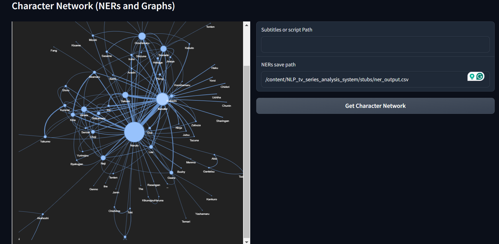
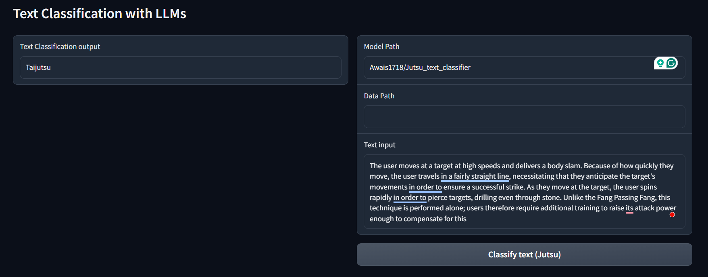
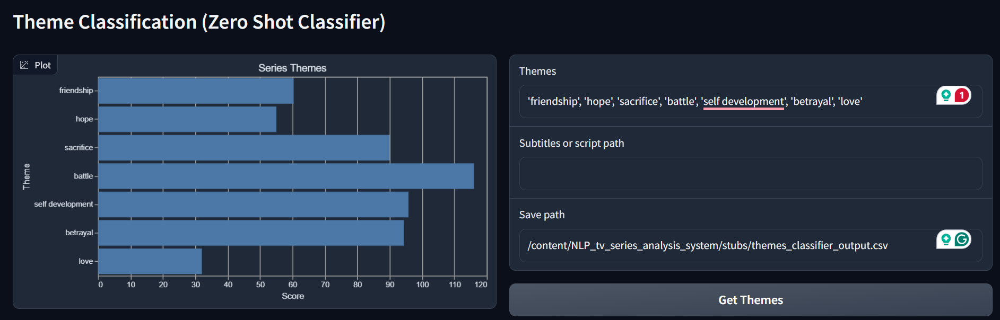
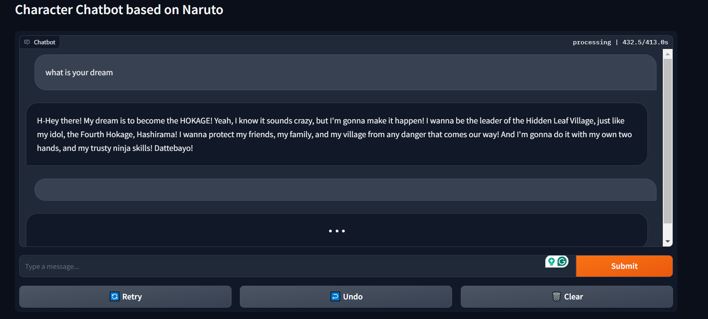

# Analyze Your Favorite Series with NLP

In this project, I analyzed a series using **Natural Language Processing (NLP)** and **Large Language Models (LLMs)**. I scraped my own dataset, used **zero-shot classifiers**, built my own **LLM text classifier**, applied **Named Entity Recognition (NER)** to build a **character network**, and created a **character chatbot** to chat with your favorite characters. Finally, I integrated everything into a web GUI using **Gradio**. This comprehensive NLP project boosted my CV and provided me with highly sought-after NLP skills.

## Overview

This project is divided into five key components, each handled by a separate model. Here’s an overview of each part:

### 1. Crawler

The `crawler` folder contains code for **web scraping** the internet to build a comprehensive dataset about the anime series using **Scrapy**. This dataset forms the foundation for the rest of the analyses.

### 2. Character Network

Using **Spacy's NER model**, **NetworkX**, and **PyViz**, I created an intricate **character network** to map relationships between characters in the series.



### 3. Text Classifier

The `text_classifier` folder contains code for training a **text classifier** that categorizes text into multiple classes, giving insights into different dialogues or narrative themes of the anime.



### 4. Theme Classifier

The `theme_classifier` folder contains code for extracting the main themes of the series using **Zero-shot classifiers**. This allows theme extraction without needing a pre-trained theme classification model.



### 5. Character Chatbot

The `character_chat_bot` folder contains code for building a character chatbot using **LLMs**, allowing users to chat with their favorite characters. For example, I built a **Naruto Character Chatbot** to interact with characters from the series *Naruto*.



## Requirements

Before running the code in this project, make sure you have installed all the necessary packages. To do this, run:

```bash
pip install -r requirements.txt 
```

